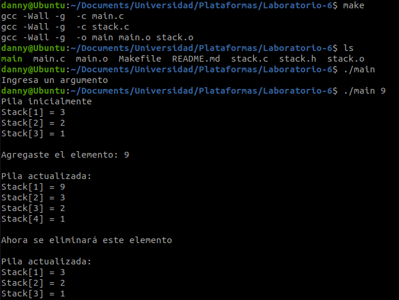
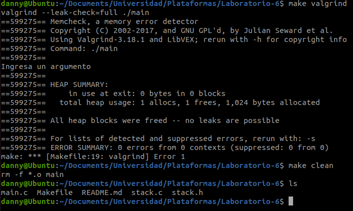

### Universidad de Costa Rica
#### IE0117 Programación Bajo Plataformas Abiertas
#### B93070 Daniela Fonseca Zumbado

# Laboratorio-6

## Introducción
En este laboratorio se aborda el uso de Listas Doblemente Enlazadas y de memoria dinámica.

El objetivo del laboratorio es desarrollar un programa que utilice estas listas para manipular el contenido del Stack.

## Implementación
### stack.c
En primer lugar, incluye una función para inicializar la pila. Además, incluye las siguientes funciones:

#### push()
#### pop()
#### peek()
#### isEmpty()

### stack.h
### main.c
### Makefile

## Resultados
Primero, se compila el programa con el uso de makefile, el cual produce el archivo ejecutable 'main'. En la imagen se puede observar que al ejecutar este archivo sin ingresar un argumento, la respuesta del programa es pedirle al usuario que lo ingrese.

Al ingresar un número como argumento, se ejecuta adecuadamente el programa. Primero, se presenta la pila predeterminada. Luego, se indica al usuario que se va a añadir el elemento que ingresó a la pila y se imprime la pila, ahora actualizada, de nuevo. Este elemento se añade en la parte superior, por medio de la función `push`.

Posteriormente, para utilizar la función de `pop` se elimina el elemento superior de la pila, el cual es el que ingresó el usuario. En la imagen se observa que después de notificar que eliminará este elemento, la pila ahora ya no lo incluye.

Se hace uso de la función `peak` al imprimir los elementos de la pila.

Para confirmar que el programa no presenta leaks de memoria, se ejecuta el programa valgrind. En la imagen se observa el reporte que indica que no hay errores. Además, se hace uso de la función de clean del makefile para eliminar los archivos que fueron generados por el programa.

## Conclusiones y recomendaciones

## Referencias
